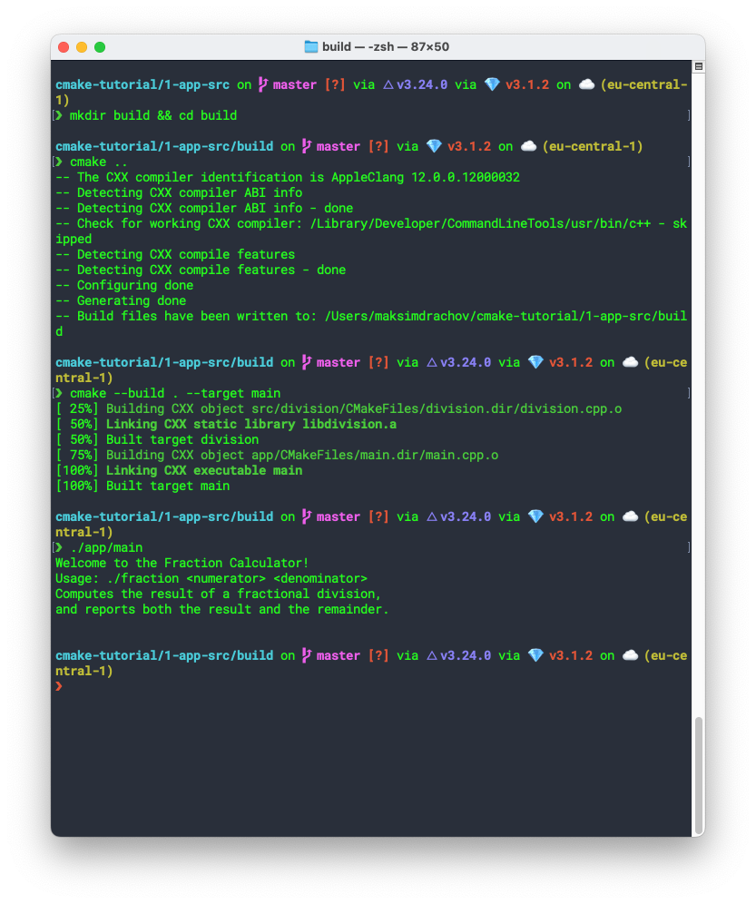
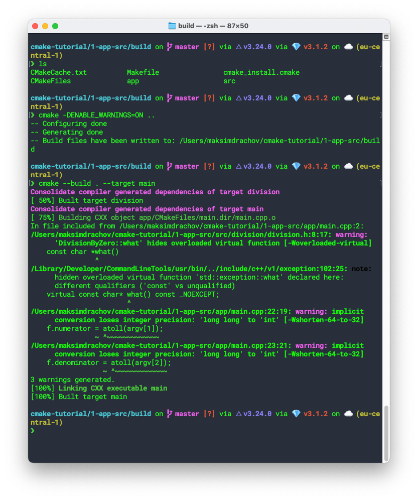

# 1-app-src

Regular build:

```bash
cd 1-app-src
mkdir build && cd build
cmake .. # generate build files
cmake --build . --target main # build the main executable
./app/main # run the main executable
```



Build with warnings enabled:

```bash
cd 1-app-src
mkdir build && cd build
cmake -DENABLE_WARNINGS=ON .. # generate build files
cmake --build . --target main # build the main executable
```

